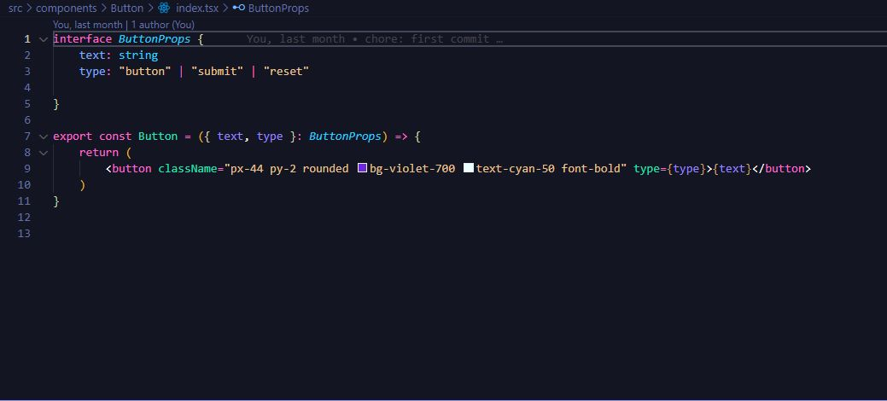
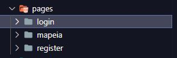
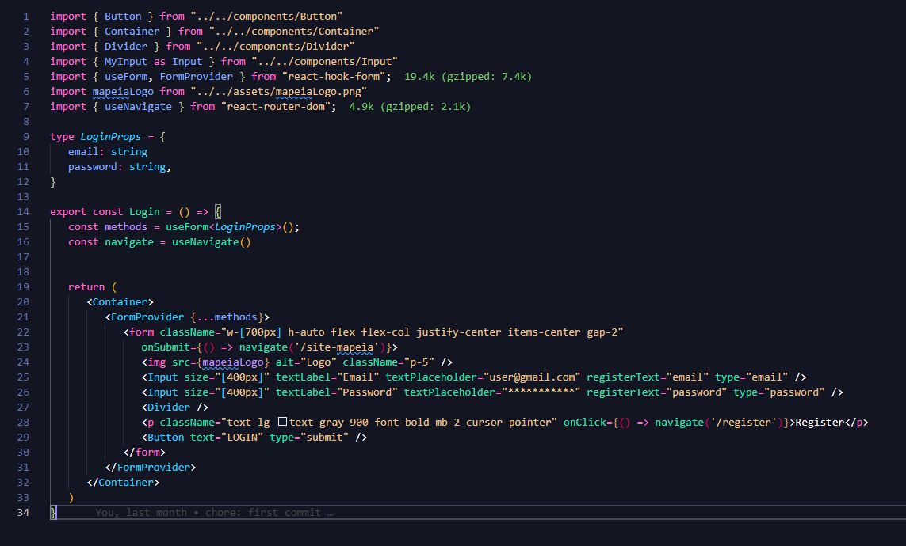
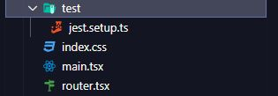

# Mapeia Project

## Este projeto foi criado com intuito educacional.

Projeto criado com utilizando React.js 
Estilização feita com tailwind.css

<h1>Estrutura do projeto.</h1>

<h3>Pasta components</h3>

Referente a todos os componentes reutilizaveis dentro da aplicação.  Aqui também encontramos os testes unitários (arquivos spec.tsx) para cada componente em espefico.

<h4>Exemplo de criação de um componente reutilizável.<h4/>

<h3>Pasta pages</h3>
  
  
Referente aos arquivos de criação de paginas

  
  <h4>Exemplo de criação de uma página.<h4/>

    
<h3>Pasta components</h3>

Arquivos de configuração de rotas e também de testes 

    
 ##
    
<h1>Comandos para rodar o projeto<h1/>
  1 - npm i ou yarn  
  2 - npm run dev ou yarn run dev
  
  
<h1>Comandos para realizar testes<h1/>
  1 - npm test ou yarn test (Roda todos os testes da aplicaçao) 
  2 - npm test (component ou pagina).spec.tsx  ou yarn test (component ou pagina).spec.tsx (Este comando roda um teste em específico)
  
